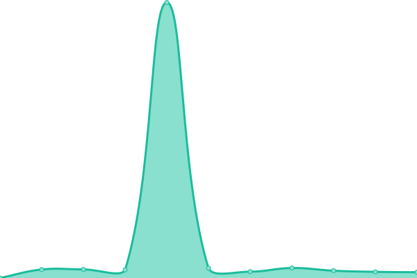
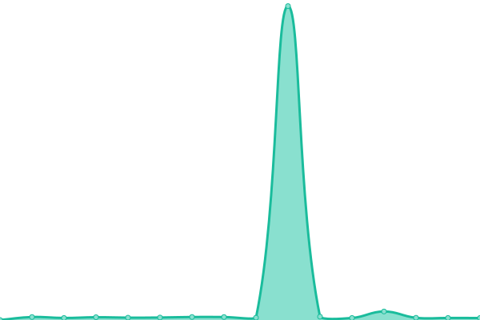
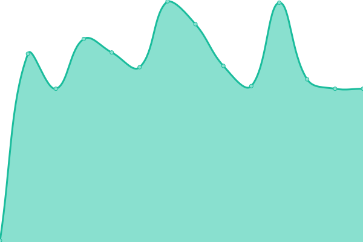

# [📈 Live Status](https://status.tvoyaridna.com): <!--live status--> **🟥 Complete outage**

This repository contains the open-source uptime monitor and status page for [Halibuben](https://status.tvoyaridna.com), powered by [Upptime](https://github.com/upptime/upptime).

With [Upptime](https://upptime.js.org), you can get your own unlimited and free uptime monitor and status page, powered entirely by a GitHub repository. We use [Issues](https://github.com/Halibuben/status-page/issues) as incident reports, [Actions](https://github.com/Halibuben/status-page/actions) as uptime monitors, and [Pages](https://status.tvoyaridna.com) for the status page.

<!--start: status pages-->
<!-- This summary is generated by Upptime (https://github.com/upptime/upptime) -->
<!-- Do not edit this manually, your changes will be overwritten -->
<!-- prettier-ignore -->
| URL | Status | History | Response Time | Uptime |
| --- | ------ | ------- | ------------- | ------ |
|  [Website & API](https://tvoyaridna.com/health) | 🟥 Down | [website-and-api.yml](https://github.com/Halibuben/status-page/commits/HEAD/history/website-and-api.yml) | 

 635ms
     
 | 

<a href="https://status.tvoyaridna.com/history/website-and-api">0.00%</a>
    

|  [Streaming API](https://tvoyaridna.com/api/v1/streaming/health) | 🟥 Down | [streaming-api.yml](https://github.com/Halibuben/status-page/commits/HEAD/history/streaming-api.yml) | 

 131ms
     
 | 

<a href="https://status.tvoyaridna.com/history/streaming-api">0.00%</a>
    

|  Media storage | 🟥 Down | [media-storage.yml](https://github.com/Halibuben/status-page/commits/HEAD/history/media-storage.yml) | 

 0ms
     
 | 

<a href="https://status.tvoyaridna.com/history/media-storage">0.00%</a>
    

|  SMTP Submission | 🟥 Down | [smtp-submission.yml](https://github.com/Halibuben/status-page/commits/HEAD/history/smtp-submission.yml) | 

 0ms
     
 | 

<a href="https://status.tvoyaridna.com/history/smtp-submission">0.00%</a>
    

|  Hosting | 🟥 Down | [hosting.yml](https://github.com/Halibuben/status-page/commits/HEAD/history/hosting.yml) | 

 0ms
     
 | 

<a href="https://status.tvoyaridna.com/history/hosting">0.00%</a>
    

<!--end: status pages-->

[**Visit our status website →**](https://status.tvoyaridna.com)

## 📄 License

- Powered by: [Upptime](https://github.com/upptime/upptime)
- Code: [MIT](./LICENSE) © [Anand Chowdhary](https://anandchowdhary.com), supported by [Pabio](https://pabio.com)
- Data in the `./history` directory: [Open Database License](https://opendatacommons.org/licenses/odbl/1-0/)
